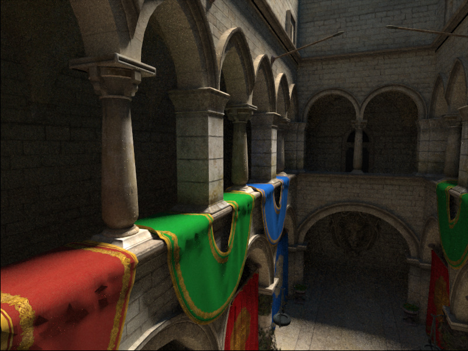
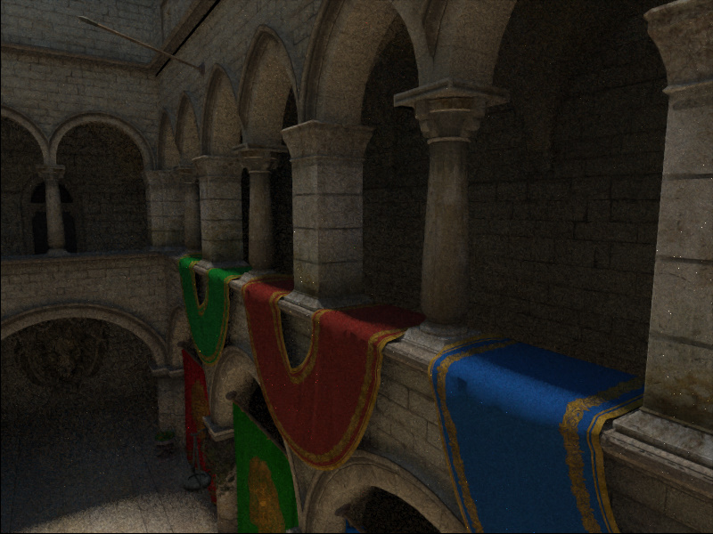
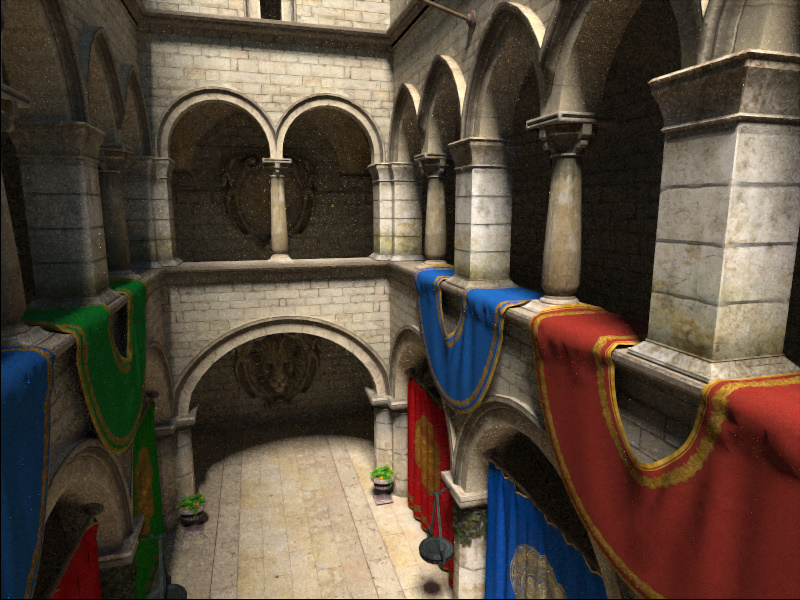
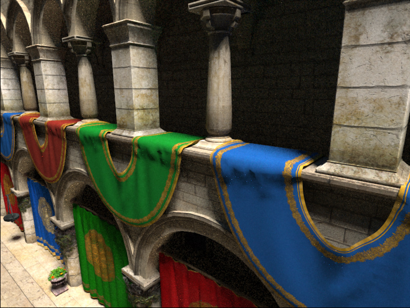
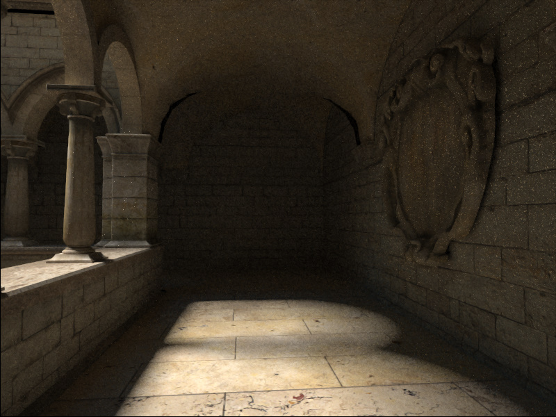
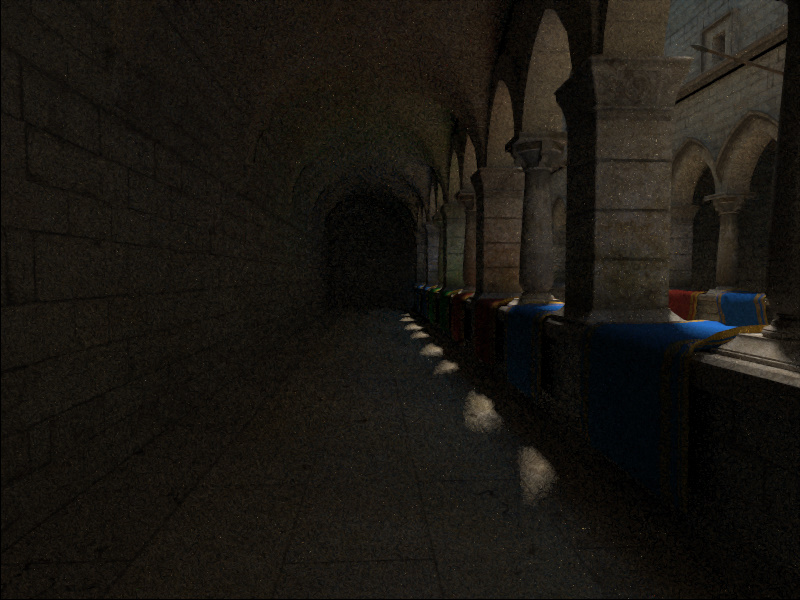
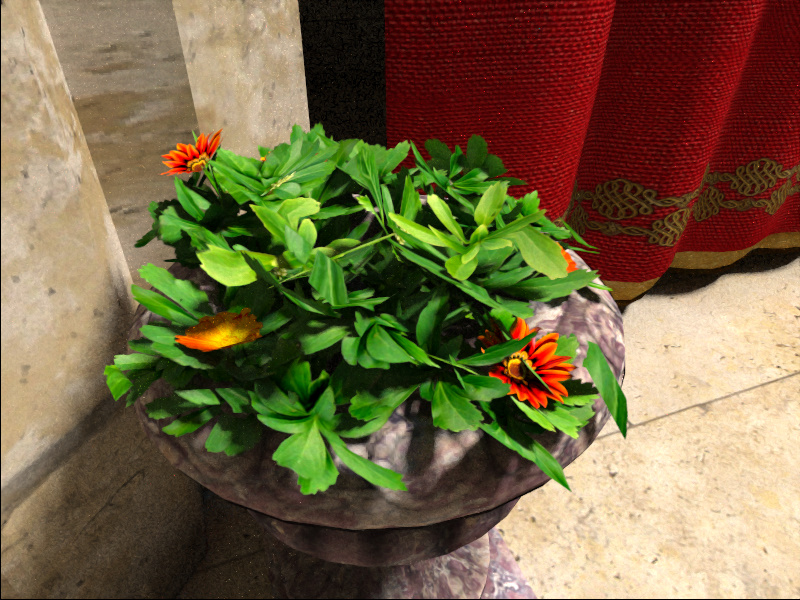
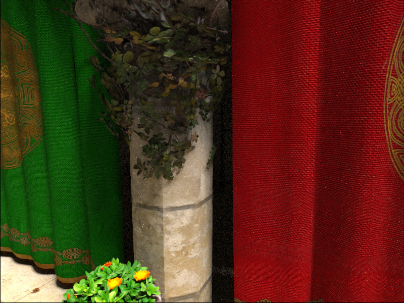
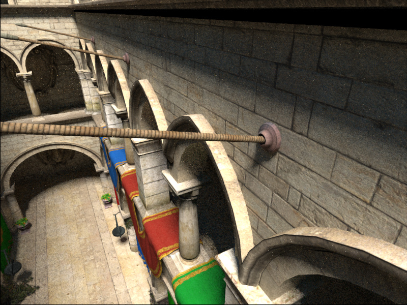

# 📝 OpenGL Ray Tracer (aka. "Paper") 📝

## 🔤 Details

- Here is headers-only (at this moment) ray tracer. May used for other projects. Main framework in shaders.

## ➕ Features: 

- CMake support (Windows)
- Phantom OpenGL wrapper (C++)
- Fixed most bugs
- GPU optimized BVH (HLBVH)
- Direct lighting for sun
- OpenGL 4.5 based
- Support NVidia GTX (tested with Pascal), planned AMD
- Real-time and interactive
- Optimized rays usage

## 🔂 Requirement

- Phantom OpenGL C++ wrapper (https://github.com/capitalknew/PhantomOGL)
- OpenGL 4.5 with extensions :)
- Latest CMake

## ⏪ Building 

- First, need clone PhantomGL headers and copy "phantom" to include dir. 
- Run CMAKE and configure project (probably, available only for Windows)
- Also, you need [shaderc](https://github.com/google/shaderc) for preprocess shaders (also can be found with Vulkan SDK)

## 💫 Running and testing

Basic render application: 

```
${ApplicationName}.exe -m sponza.obj -s 1.0
-m model_name.obj   - loading 3D model to view (planned multiply models and animation support)
-s 1.0              - scaling of 3D model
```

## 🌐 Screenshots

### Sponza (diffuse only, 08-06-2017)

🕐 Rendered every roundly 1/2 of minute.











## 🆙 Contributors

- ???

## 🔟 Leaders

- Alexey S (capitalknew@gmail.com)

## 🆗 Inspired by

- [RadeonRays SDK](https://github.com/GPUOpen-LibrariesAndSDKs/RadeonRays_SDK)
- [WebGL Path Tracing by evanw (and forks)](https://github.com/evanw/webgl-path-tracing)
- [GPU Path Tracer by peterkutz](https://github.com/peterkutz/GPUPathTracer)
- [Something from Shadertoy](https://www.shadertoy.com/)
- [Radix Sort by CiNoNim](https://github.com/cNoNim/radix-sort)
- Other functions and modifications from few resources
