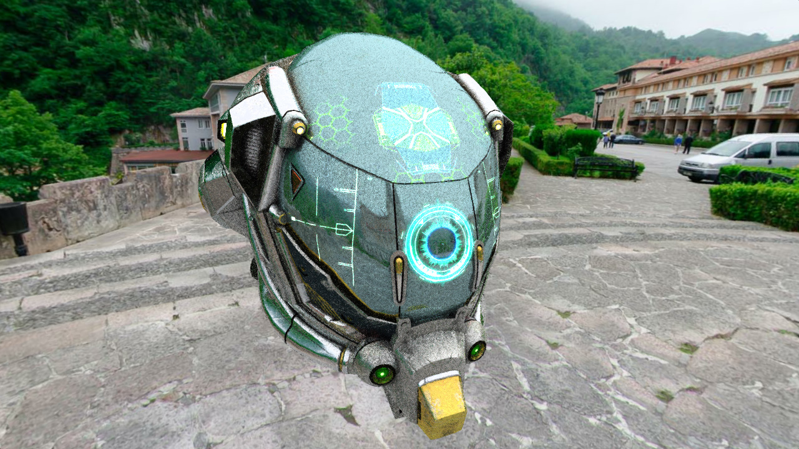
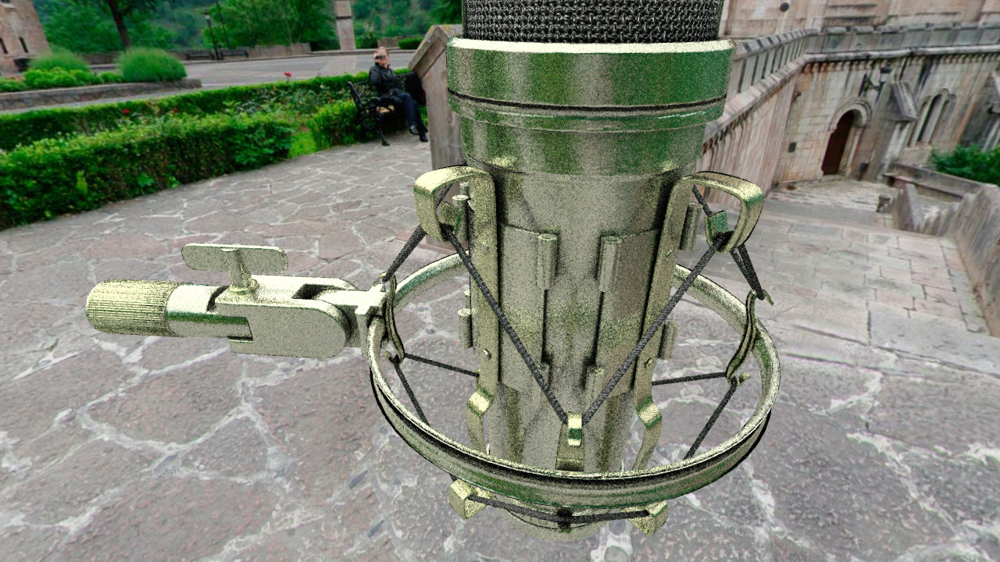
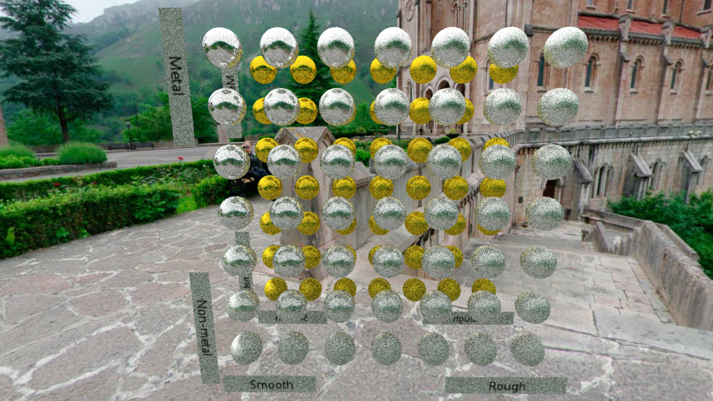

# OpenGL Ray Tracer (aka. "Prismarine")

## Updates

<details>
<summary>Highway Update (beta)</summary>

### "Highway" Update (formelly OpenGL 4.6) Mainly Done (06.08.2017)


- [x] Use compatible library with OpenGL 4.6
- [x] Change shading language version to **460**
- [x] OpenGL 4.6 subgroup vote support
- [x] SPIR-V support
- [x] Indirect dispatch buffer in vertex instance objects
- [ ] Memory and semaphores extensions support (alike Vulkan API)
- [ ] Float 16 bit support (AMD)
- [ ] Float 64 bit support (Nvidia)
- [ ] Full AMD extensions support
</details>

<details>
<summary>Master Update (on development)</summary>

### "Master" Update (low level API, tweaks) WIP (??.08.2017)


- [x] (Beta) Fully device memory based storing and copying, when loading mesh (less overhead instancing)
- [x] (Beta) Divide uploading and current scene state (you can load meshes, while you using in traverse stable state)
- [x] (Alpha) Lower level accessor set and virtual accessor
- [x] (Alpha) Divide BVH traverse and primitive intersection stages
- [x] (Alpha) Direct traverse variant without buffering
- [x] (Alpha) Surface and environment shaders 
- [ ] (WIP) Class refactoring
- [ ] (WIP) Structural refactoring
- [ ] (WIP) Shaders refactoring
- [ ] Support of external constant and data buffers
- [ ] Support of user defined vertex attributes (at now support only accessors)
- [ ] Advanced optimization
</details>

<details>
<summary>Clockwork Update (on development)</summary>

### "Clockwork" Update (improved BVH system) planned (??.??.2017)


- [x] (Alpha) Support of 64-bit morton code check-sums
- [ ] SIMT optimized intersection and traverse stage
- [ ] Sorting hit chains by range (for better exclusion of triangle hits)
- [ ] Consideration of trBVH support
</details>


## Screenshots

<details>
<summary>8 August 2017</summary>






</details>

## Details

- Here is headers-only (at this moment) ray tracer. May used for other projects. Main framework in shaders.

## Features: 

- CMake support (Windows)
- Fixed most bugs
- GPU optimized BVH (HLBVH)
- Direct light for sun
- Modern OpenGL based
- Support NVidia GTX 1070 and newer
- Optimized for performance
- Open source (at now)

## Requirement

- OpenGL 4.6 with extensions :)
- Latest CMake

## Building 

- Run CMAKE and configure project (probably, available only for Windows)
- Also, you need [shaderc](https://github.com/google/shaderc) for preprocess shaders (also can be found with Vulkan SDK)

## Running and testing

Basic render application: 

```
${ApplicationName}.exe -m sponza.obj -s 1.0
-m model_name.obj   - loading 3D model to view (planned multiply models and animation support)
-s 1.0              - scaling of 3D model
```

## Contributors

- ???

## Leaders

- Alexey S (capitalknew@gmail.com)

## Inspired by

- [RadeonRays SDK](https://github.com/GPUOpen-LibrariesAndSDKs/RadeonRays_SDK)
- [WebGL Path Tracing by evanw (and forks)](https://github.com/evanw/webgl-path-tracing)
- [GPU Path Tracer by peterkutz](https://github.com/peterkutz/GPUPathTracer)
- [Something from Shadertoy](https://www.shadertoy.com/)
- [Radix Sort by CiNoNim](https://github.com/cNoNim/radix-sort)
- Other functions and modifications from few resources
