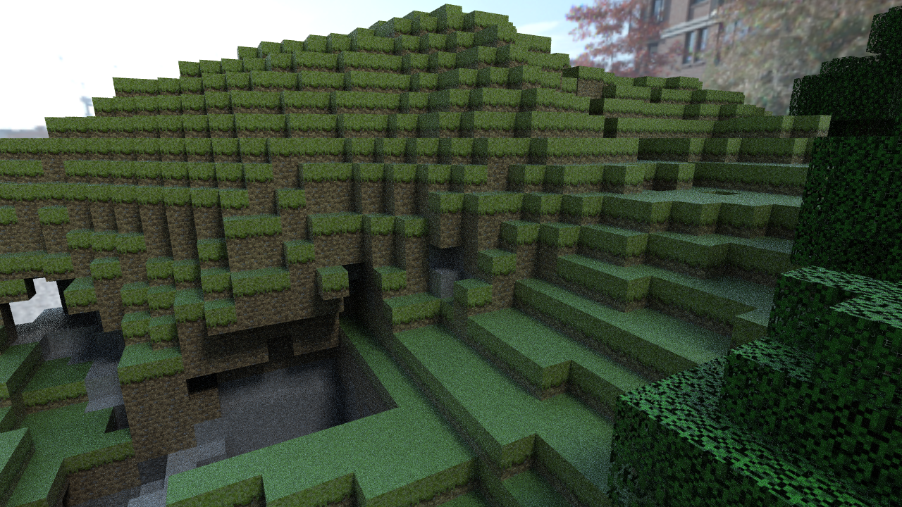

# OpenGL Ray Tracer (aka. "Prismarine")

## Updates

See `Projects`. 

## Screenshots

<details>
<summary>9/3/2017 (1280x720)</summary>



</details>

## Details

- Here is headers-only (at this moment) ray tracer. May used for other projects. Main framework in shaders.

## Features: 

- CMake support (Windows)
- Fixed most bugs
- GPU optimized BVH (HLBVH)
- Direct light for sun
- Modern OpenGL based
- Support NVidia GTX 1070 and newer
- Optimized for performance
- Open source (at now)

## Requirement

- OpenGL 4.6 with extensions :)
- Latest CMake

## Building 

- Run CMAKE and configure project (probably, available only for Windows)
- Also, you need [shaderc](https://github.com/google/shaderc) for preprocess shaders (also can be found with Vulkan SDK)

## Running and testing

Basic render application: 

```
${ApplicationName}.exe -m sponza.obj -s 1.0
-m model_name.obj   - loading 3D model to view (planned multiply models and animation support)
-s 1.0              - scaling of 3D model
```

## Contributors

- ???

## Leaders

- Alexey S (capitalknew@gmail.com)

## Inspired by

- [RadeonRays SDK](https://github.com/GPUOpen-LibrariesAndSDKs/RadeonRays_SDK)
- [WebGL Path Tracing by evanw (and forks)](https://github.com/evanw/webgl-path-tracing)
- [GPU Path Tracer by peterkutz](https://github.com/peterkutz/GPUPathTracer)
- [Something from Shadertoy](https://www.shadertoy.com/)
- [Radix Sort by CiNoNim](https://github.com/cNoNim/radix-sort)
- Other functions and modifications from few resources
